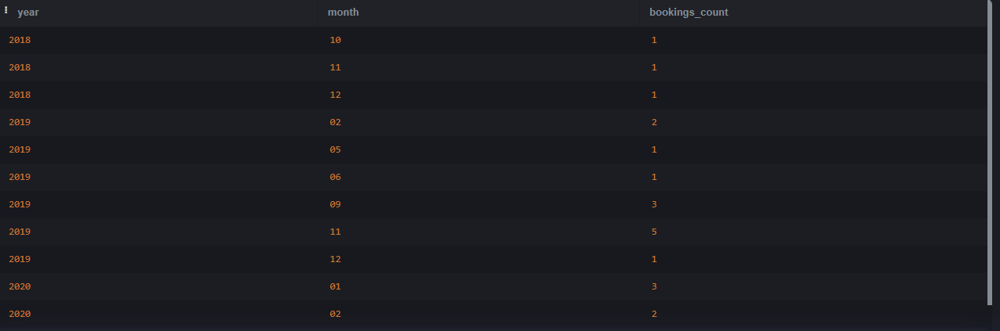
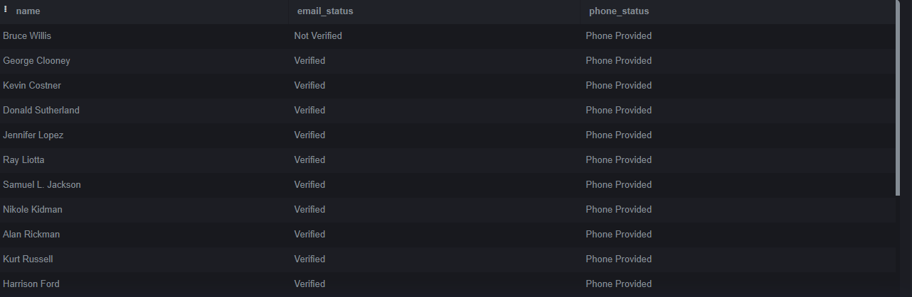
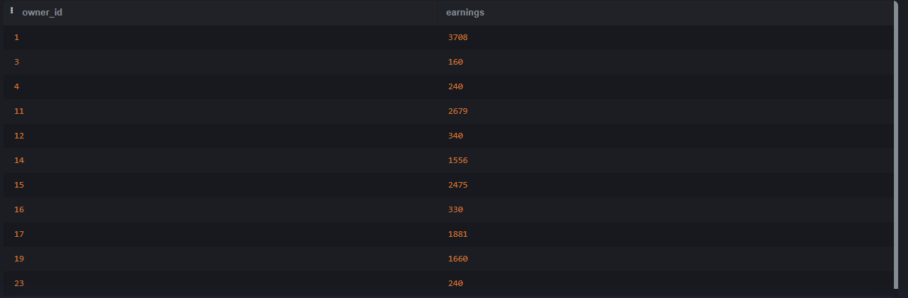

## Задания по SQL (Airbnb)

*Базы данных лежат в директории `/tests` под номером задания.*

#### Сложность: легко

[#74](tests/74/74.md) `Airbnb` Выведите идентификатор и признак наличия интернета в помещении. Если интернет в сдаваемом жилье присутствует, то выведите «YES», иначе «NO».
SELECT id, 
       CASE WHEN has_internet THEN 'YES' ELSE 'NO' END AS internet_available
FROM rooms;
#### Сложность: средняя

[#59](tests/59/59.md) `Airbnb` Вывести пользователей, указавших Белорусский номер телефона.
SELECT id, name, phone_number
FROM users
WHERE phone_number LIKE '+375%';

[#61](tests/61/61.md) `Airbnb` Выведите список комнат, которые были зарезервированы хотя бы на одни сутки в 12-ую неделю 2020 года.
SELECT strftime('%Y', start_date) AS year, 
       strftime('%m', start_date) AS month, 
       COUNT(*) AS bookings_count
FROM reservations
GROUP BY year, month
HAVING bookings_count > 0;

[#62](tests/62/62.md) `Airbnb` Вывести в порядке убывания популярности доменные имена 2-го уровня, используемые пользователями для электронной почты.
SELECT substr(email, instr(email, '@') + 1) AS domain, 
       COUNT(*) AS count
FROM users
GROUP BY domain
ORDER BY count DESC;

[#64](tests/64/64.md) `Airbnb` Вывести количество бронирований по каждому месяцу каждого года, в которых было хотя бы 1 бронирование.
SELECT room_id, 
       AVG(price / (julianday(end_date) - julianday(start_date))) AS avg_price_per_day
FROM reservations
WHERE julianday(end_date) > julianday(start_date)
GROUP BY room_id;

[#65](tests/65/65.md) `Airbnb` Необходимо вывести рейтинг для комнат, которые хоть раз арендовали, как среднее значение рейтинга отзывов округленное до целого вниз.
SELECT r.id AS room_id, u.name, res.end_date
FROM rooms r
JOIN reservations res ON r.id = res.room_id
JOIN users u ON res.user_id = u.id
WHERE res.end_date = (
    SELECT MAX(res2.end_date) FROM reservations res2 WHERE res2.room_id = r.id
);

[#66](tests/66/66.md) `Airbnb` Вывести список комнат со всеми удобствами (наличие ТВ, интернета, кухни и кондиционера), а также общее количество дней и сумму...
SELECT id, home_type, address, price
FROM rooms
WHERE has_tv = 1 AND has_internet = 1 AND has_kitchen = 1 AND has_air_con = 1;

[#70](tests/70/70.md) `Airbnb` Необходимо категоризовать жилье на economy, comfort, premium по цене соответственно <= 100, 100 < цена < 200, >= 200.
SELECT id, home_type, price, 
       CASE 
           WHEN price <= 100 THEN 'economy' 
           WHEN price BETWEEN 101 AND 199 THEN 'comfort' 
           ELSE 'premium' 
       END AS category
FROM rooms;

[#72](tests/72/72.md) `Airbnb` Выведите среднюю цену бронирования за сутки для каждой из комнат, которую бронировали хотя бы один раз.
SELECT room_id, 
       AVG(price / (julianday(end_date) - julianday(start_date))) AS avg_price_per_day
FROM reservations
WHERE julianday(end_date) > julianday(start_date)
GROUP BY room_id;

[#73](tests/73/73.md) `Airbnb` Выведите id тех комнат, которые арендовали нечетное количество раз
SELECT room_id
FROM reservations
GROUP BY room_id
HAVING COUNT(*) % 2 = 1;

[#76](tests/76/76.md) `Airbnb` Вывести имена всех пользователей сервиса бронирования жилья, а также два признака...
SELECT name, 
       CASE WHEN email_verified_at IS NOT NULL THEN 'Verified' ELSE 'Not Verified' END AS email_status,
       CASE WHEN phone_number IS NOT NULL THEN 'Phone Provided' ELSE 'No Phone' END AS phone_status
FROM users;

[#78](tests/78/78.md) `Airbnb` Выведите всех пользователей с электронной почтой в «hotmail.com»
SELECT id, name, email
FROM users
WHERE email LIKE '%@hotmail.com';

[#79](tests/79/79.md) `Airbnb` Выведите поля id, home_type, price у всего жилья из таблицы Rooms.
SELECT id, home_type, price
FROM rooms;

[#80](tests/80/80.md) `Airbnb` Создайте представление «Verified_Users» с полями id, name и email, которое будет показывает только тех пользователей...
CREATE VIEW Verified_Users AS
SELECT id, name, email
FROM users
WHERE email_verified_at IS NOT NULL;

#### Сложность: высокая

[#58](tests/58/58.md) `Airbnb` Добавить отзыв с рейтингом 5 на жилье, находящиеся по адресу "11218, Friel Place, New York", от имени "George Clooney"
INSERT INTO reviews (reservation_id, rating)
SELECT res.id, 5
FROM reservations res
JOIN rooms r ON res.room_id = r.id
JOIN users u ON res.user_id = u.id
WHERE r.address = '11218, Friel Place, New York' 
AND u.name = 'George Clooney'
LIMIT 1;
[#68](tests/68/68.md) `Airbnb` Для каждой комнаты, которую снимали как минимум 1 раз, найдите имя человека, снимавшего ее последний раз, и дату, когда он выехал
SELECT r.id AS room_id, u.name, res.end_date
FROM rooms r
JOIN reservations res ON r.id = res.room_id
JOIN users u ON res.user_id = u.id
WHERE res.end_date = (
    SELECT MAX(res2.end_date) FROM reservations res2 WHERE res2.room_id = r.id
);

[#69](tests/69/69.md) `Airbnb` Вывести идентификаторы всех владельцев комнат, что размещены на сервисе бронирования жилья и сумму, которую они заработали
SELECT r.owner_id, SUM(res.total) AS earnings
FROM rooms r
JOIN reservations res ON r.id = res.room_id
GROUP BY r.owner_id;

[#71](tests/71/71.md) `Airbnb` Найдите какой процент пользователей, зарегистрированных на сервисе бронирования, хоть раз арендовали или сдавали в аренду жилье. 
SELECT 
    (COUNT(DISTINCT u.id) * 100.0 / (SELECT COUNT(*) FROM users)) AS percentage_active_users
FROM users u
LEFT JOIN reservations res ON u.id = res.user_id 
OR u.id IN (SELECT owner_id FROM rooms);
