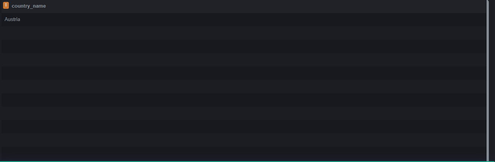
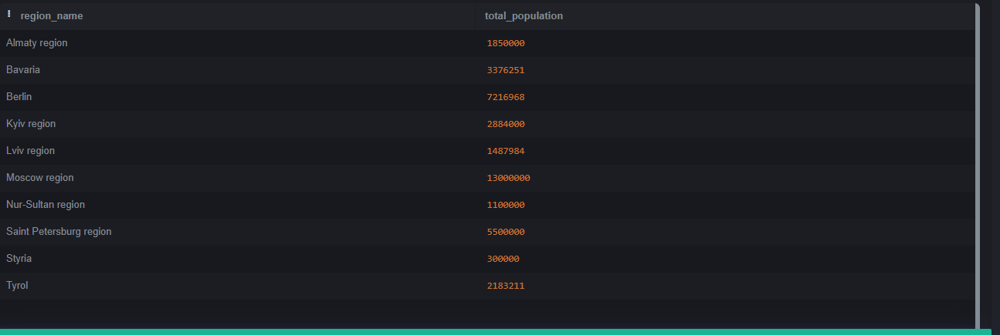

## Задания по SQL (Domclick)

*Базы данных лежат в директории `/tests` под номером задания.*

#### Сложность: легко

[#109](tests/109/109.md) `Тестовое задание ДомКлик` Выведите название страны, где находится город «Salzburg»
```sql
SELECT c.name AS country_name
FROM countries c
JOIN regions r ON c.id = r.countryid
JOIN cities ct ON r.id = ct.regionid
WHERE ct.name = 'Salzburg';
```


#### Сложность: средняя

[#111](tests/111/111.md) `Тестовое задание ДомКлик` Посчитайте население каждого региона. В качестве результата выведите название региона и его численность населения.
```sql
SELECT r.name AS region_name, SUM(ct.population) AS total_population
FROM regions r
JOIN cities ct ON r.id = ct.regionid
GROUP BY r.name;
```
